# AMARadio

[](http://www.gnu.org/licenses/gpl-3.0.html)
<a href='https://play.google.com/store/apps/details?id=com.ounben.amaradio'></a>

**AMARadio** is a professional, open-source Android application designed for streaming radio stations globally. It leverages the community-driven [radio-browser.info](https://www.radio-browser.info/) database to provide access to thousands of stations.

This project is a refined fork of RadioDroid, optimized for a more focused, accessible, and stable user experience. The codebase has been completely migrated to **100% Kotlin**, adopting modern Android standards and ensuring full compatibility with Android 14 and 15.

## Core Philosophy

**Ad-Free and Privacy-Focused**: AMARadio was developed with the primary goal of providing a clean, honest radio experience. It contains no advertisements, no tracking, and no bloatware. 

Originally created as a personal project for the developer's mother to provide a simple, distraction-free way to enjoy global radio, AMARadio remains committed to these core values of transparency and accessibility for all users.

## Key Features

- **Instantaneous UI**: Leverages an Activity-scoped ViewModel architecture and background pre-rendering to ensure that switching between tabs and opening the player is instant and flicker-free.
- **Full Global Accessibility**: Extensively optimized for **TalkBack** and screen readers. Features semantic grouping of station information for fluid navigation, localized accessibility strings in all 74+ supported languages, and "speaking" status icons.
- **Advanced Search and Filtering**: A dedicated filtering system allows users to find stations by Name, Country, Language, and Tags. Metadata for 11,000+ tags is cached locally for instant, offline suggestions.
- **Dynamic UI Scaling**: Built-in accessibility settings allow for dynamic adjustment of the user interface, including font and component sizes, ranging from Compact to Extra Large.
- **Multi-Language Support**: Support for over **74 locales**, including newly added African languages (Afrikaans, Amharic, Swahili, Zulu) and a dedicated in-app language selector.
- **Modern Material Design**: A clean, streamlined interface built with **Jetpack Compose**, featuring full support for Dark and Light modes and edge-to-edge system integration.
- **Global Station Database**: Instant access to a massive, community-maintained directory of international radio stations.
- **Optimized Performance**: High-stability streaming engine based on AndroidX Media3 (ExoPlayer) with intelligent connection management, real-time audio thread prioritization, strict audio focus handling, and MD5-hashed local caching for API responses.
- **Fail-Over API Support**: Automatic fallback to mirror servers ensures uninterrupted station browsing even if the primary database is down.
- **Privacy & Compliance**: Fully compliant with modern Android privacy standards, including proper attribution tagging and secure background execution.
- **Favorites and History**: Efficient management of preferred stations and playback history with support for M3U playlist export/import.
- **Sleep Timer**: Integrated sleep timer functionality to automatically stop playback after a set duration.
- **Android TV Support**: Specialized user interface optimized for television and large-screen devices.

## Screenshots

<p align="center">
  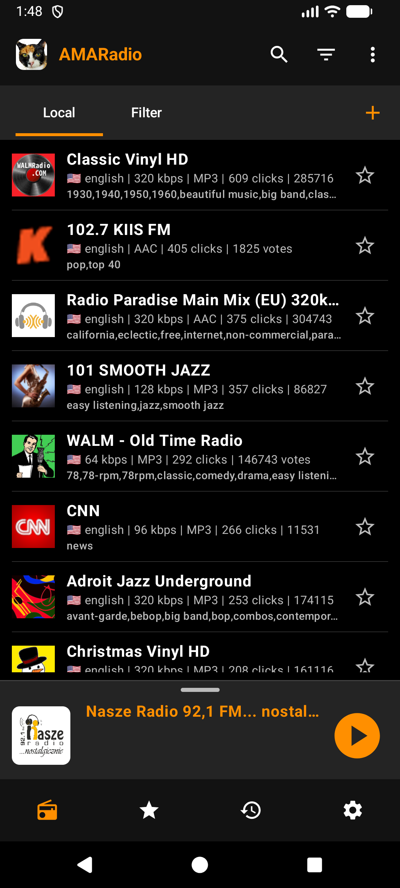
  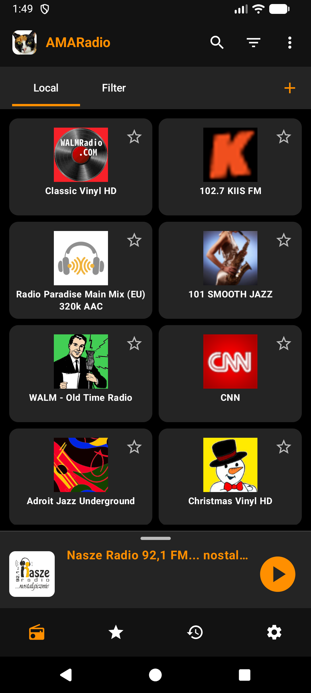
  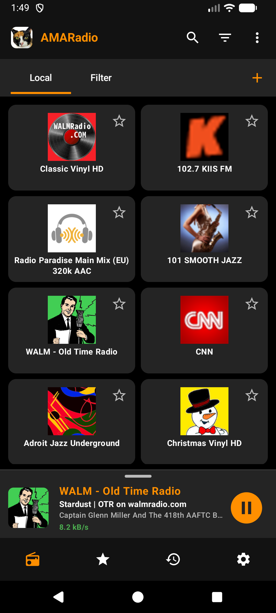
  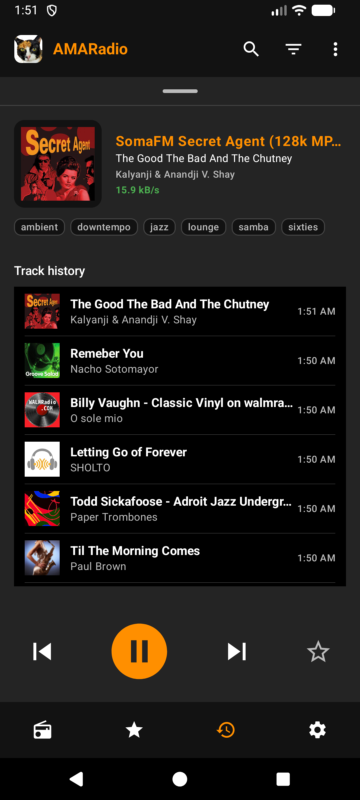
</p>
<p align="center">
  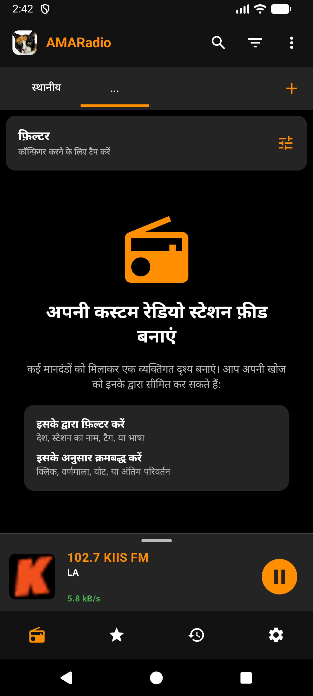
  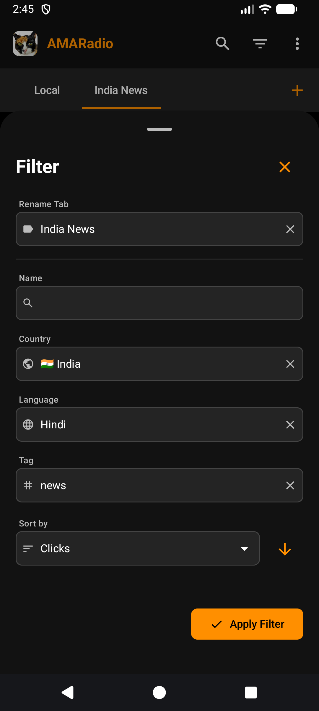
  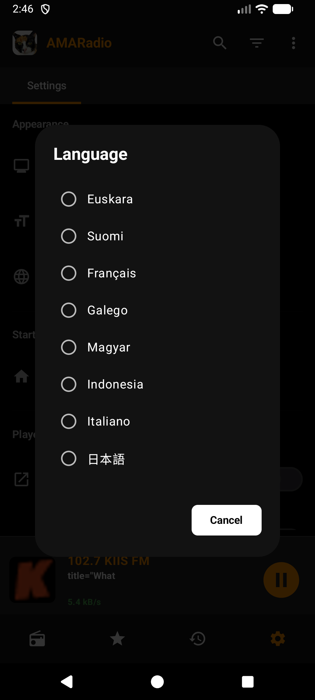
  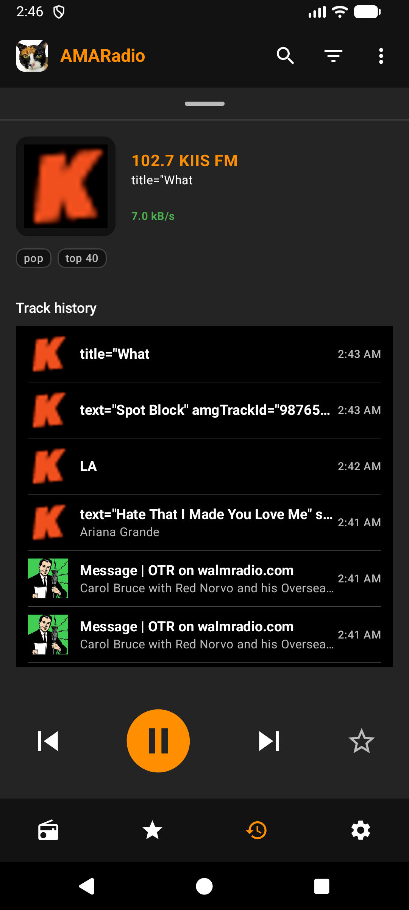
</p>
<p align="center">
  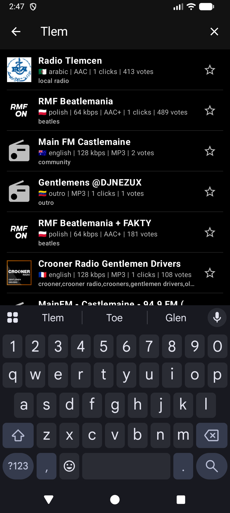
  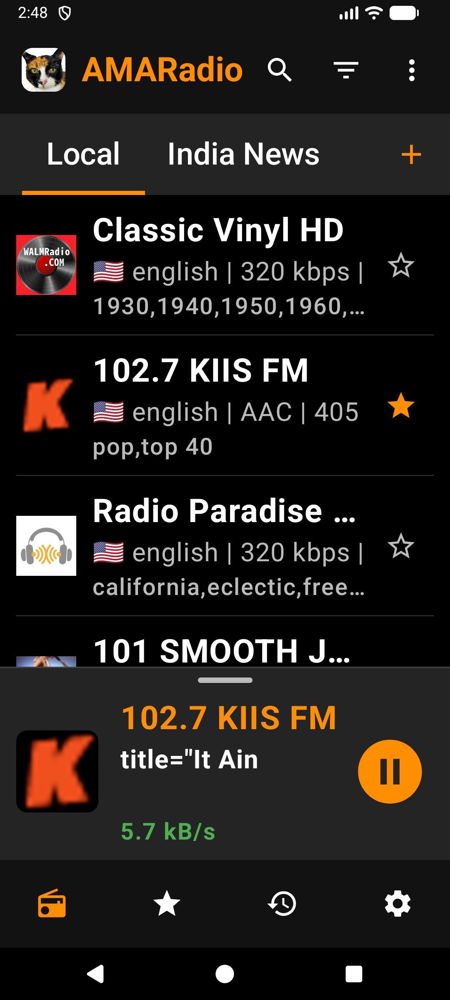
  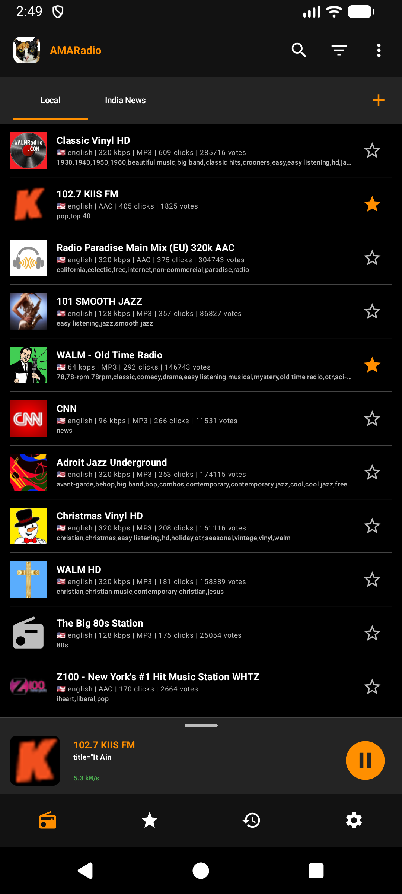
  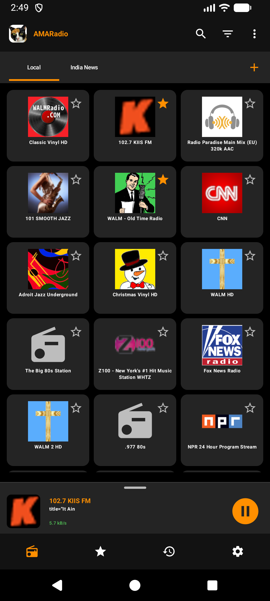
</p>
<p align="center">
  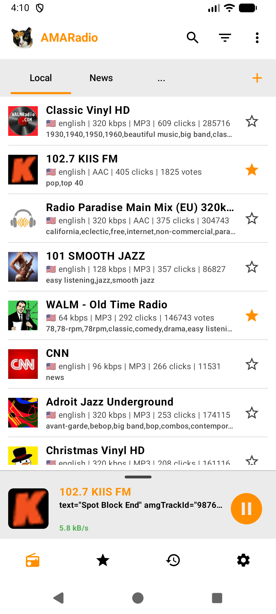
  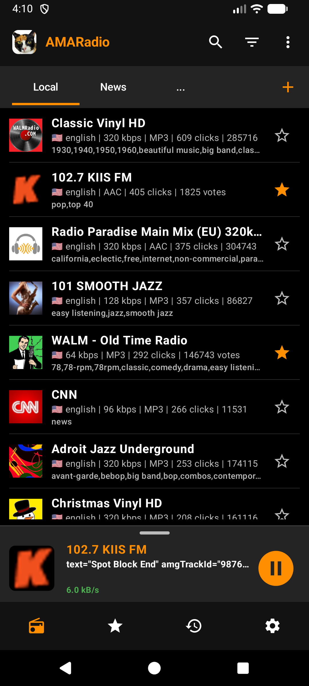
  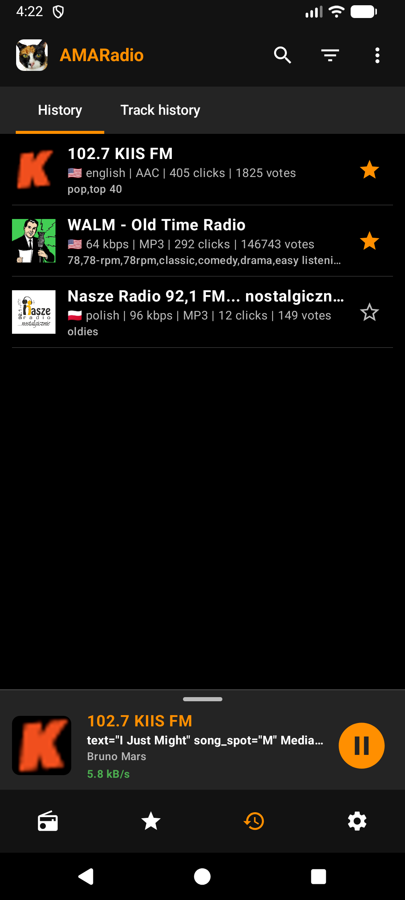
  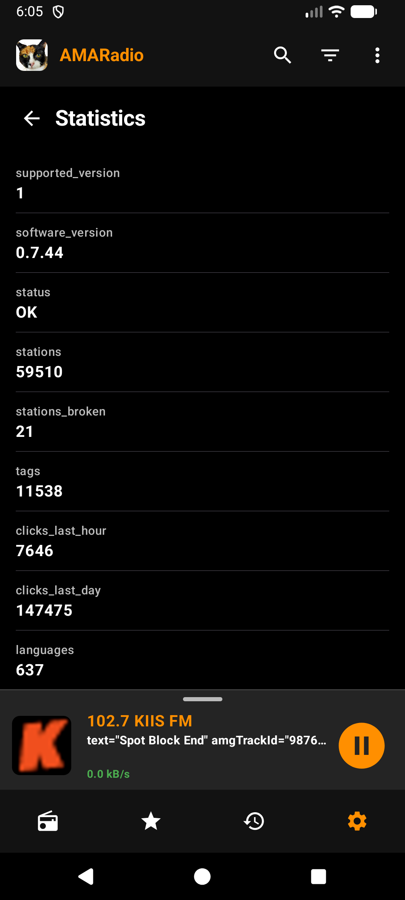
</p>

## Getting Started

### Installation
The latest version (v0.99.6) introduces significant performance optimizations, advanced caching, and a new multi-language selector. You can download the application from the [Google Play Store](https://play.google.com/store/apps/details?id=com.ounben.amaradio) or the GitHub releases page.

### Building from Source
To build the project locally, ensure you have the latest version of Android Studio installed.

1. Clone the repository:
   ```bash
   git clone https://github.com/ounben/AMARadio.git
   ```
2. Open the project in **Android Studio**.
3. Build using the Gradle wrapper:
   ```bash
   ./gradlew assembleDebug
   ```

## Technical Specification

- **Language**: 100% Kotlin
- **UI Framework**: Jetpack Compose & Material 3
- **Architecture**: MVVM with Activity-scoped ViewModels for state persistence
- **Persistence**: Room Database for history, SharedPreferences for configuration
- **Networking**: OkHttp 5 & Coroutines for API communication, Coil for async image loading
- **Media Engine**: AndroidX Media3 (ExoPlayer)
- **Target SDK**: 37 (Android 17)
- **Minimum SDK**: 26 (Android 8.0)

## Contributing

Contributions are welcome and appreciated. If you wish to improve the codebase, fix bugs, or update translations, please follow these steps:
- Report issues via the [GitHub Issue Tracker](https://github.com/ounben/AMARadio/issues).
- Submit improvements via Pull Requests.
- Translation updates are highly encouraged to improve global accessibility.

## License

This project is licensed under the **GNU General Public License v3.0**. Detailed information can be found in the [LICENSE](LICENSE) file.

---
<p align="center">
  AMARadio - Professional Radio Streaming for Android.
</p>
