[](https://www.gnu.org/licenses/gpl-3.0)
[](https://reports.exodus-privacy.eu.org/de/reports/com.ounben.amaradio/latest/)
[](https://www.virustotal.com/gui/url/aa8b0a5d3cdb32e328509858b39baefc0e32b72732a566510e4dfc323b0ee43e/details)
[](https://play.google.com/store/apps/details?id=com.ounben.amaradio)
[](https://f-droid.org/packages/com.ounben.amaradio/)
[](https://github.com/OunBen/AMARadio/releases/latest)
[](https://www.radio-browser.info/)
[](https://kotlinlang.org/)

# AMARadio Open Source Radio
Ad-Free - No Paywall - Just Radio

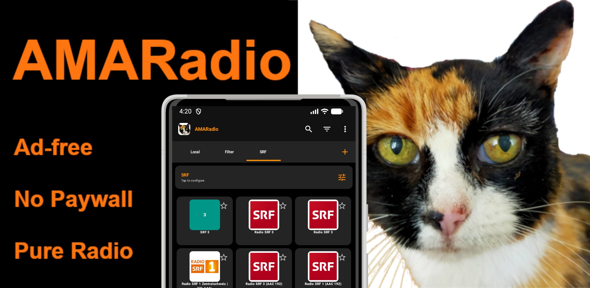

**AMARadio** is an open-source Android application for worldwide radio streaming. By leveraging the community-supported [radio-browser.info](https://www.radio-browser.info/) database, AMARadio provides instant access to thousands of stations in a stable, modern, and user-friendly environment.

<div align="left">
  <a href="https://play.google.com/store/apps/details?id=com.ounben.amaradio"></a>
  <a href="https://f-droid.org/packages/com.ounben.amaradio">
    </a>
  <a href="obtainium://add/https://github.com/ounben/AMARadio"></a>
  <br />
  <sub>(Obtainium installed? <a href="obtainium://add/https://github.com/ounben/AMARadio">Add directly</a> | No Obtainium? <a href="https://github.com/ImranR98/Obtainium">Download app</a>)</sub>
</div>

## Core Philosophy

AMARadio was developed to enable an honest and distraction-free listening experience. The app is **completely ad-free, contains no tracking, and no unnecessary bloatware**. Originally started as a personal project to create a simple and accessible interface for global radio, the app remains consistently transparent and easy to use – for everyone.

## Acknowledgments

Special thanks to the [RadioDroid](https://github.com/Segler-Alex/RadioDroid) project for the inspiration and ground-breaking work in open-source radio streaming.

## Key Features

- **Instantaneous UI**: Thanks to a highly optimized architecture, switching between tabs and opening the player occurs without delay or flickering.
- **Google Cast (Chromecast) Support**: Stream directly to speakers and TVs using the modern **Media3 Cast** framework. Features a native Compose-based connection button for easy device management.

- **Advanced Android Auto Integration**:
  - **Stability (Media-Anchor)**: Specialized logic to prevent session disconnects during station switches on modern Android versions (15+).
  - **HLS/TS Support**: Full compatibility with complex Transport Stream formats.
  - **Optimized UI**: Compact list designs, driver-safe folder hierarchy, and prioritized metadata (Station Name first) for maximum legibility.

- **Modern Home Screen Widgets**: Feature-rich widgets based on **Jetpack Glance**.
  - **Anti-Ghost Architecture**: Optimized to prevent "black app" entries in Android Recents via direct background service starts.
  - **Sequential Sync**: High-performance reactive model with Mutex-based update sequencing for 100% state consistency.
  - **Live Track Info**: Real-time Artist and Song Title displays using optimized Media3 event listeners.
  - **Professional Previews**: Adaptive XML-based previews in the system widget picker.

- **Custom Radio Stations**: A dedicated management system for personal streams.
  - **Native Drag & Drop**: Smooth, high-performance reordering using the latest Compose 1.7 APIs.
  - **Local Image Support**: Use your own icons for personal streams, with automated permanent storage.
  - **Smart Catalog Matching**: Automatically retrieves metadata and tags if a custom URL matches an entry in the community database.

- **Comprehensive Accessibility**: Fully optimized for **TalkBack** and screen readers. Features semantic grouping of information, localized accessibility strings in over 74 languages, and "speaking" status icons for fluid navigation.

- **Advanced Search & Filtering**: Find stations by Name, Country, Language, or Tags. Metadata for over **11,000 tags** is cached locally in a high-performance SQL database to enable instant offline suggestions.

- **Community Support (Click Counting)**: Supports the global ranking of radio stations by reporting playback clicks directly to the official radio-browser.info API.
- **Dynamic UI Scaling**: Custom settings allow for the adjustment of the user interface size from Compact to Extra Large.

- **Broad Language Support**: Support for over **74 languages**, including a variety of African languages (Afrikaans, Amharic, Swahili, Zulu) with a dedicated in-app language selector.

- **Ogg & Opus Metadata**: Full dynamic track information support for Ogg Vorbis and Opus streams, including seamless updates for chained streams.

- **Modern Design**: Developed with **Jetpack Compose**, featuring seamless support for Dark/Light modes and edge-to-edge system integration.

- **High-Performance Streaming**: A robust engine based on **AndroidX Media3 (ExoPlayer)** with real-time audio thread prioritization, strict audio focus handling, dynamic session management, and asynchronous network processing to prevent UI lag.

- **Optimized Image Loading**: Leverages the **Coil** framework across the entire app, including the Media3 Session, to ensure memory-efficient and lightning-fast delivery of station icons and artwork.

- **Data Consistency**: Specialized logic for instant synchronization between the Smartphone UI, Home Screen Widgets, and Android Auto units using direct SQL access and proactive reactive flows.

- **High Availability**: Integrated failover support via mirror servers ensures uninterrupted station browsing even if the primary database is offline.

- **Smart Management**: Includes a sleep timer, efficient favorites management, and full support for M3U playlist export/import.

- **Robust Data Resilience**: Features a unique **Dual-Database Architecture** that strictly separates the global radio catalog from personal user data (Favorites, History, Filters). This ensures your personal settings are never lost during global database updates.

## Youtube Video
<p align="left">
  <a href="https://www.youtube.com/watch?v=JTJLFj8M1XI">
    
  </a>
  <br />
<sub>--> <a href="https://www.youtube.com/watch?v=JTJLFj8M1XI">Watch full video demo on YouTube</a></sub>  </a>
</p>


## Screenshots

<p align="left">
  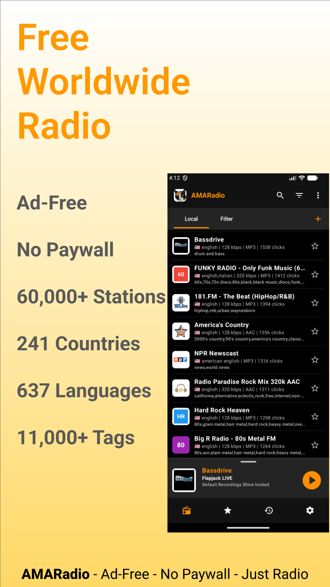
  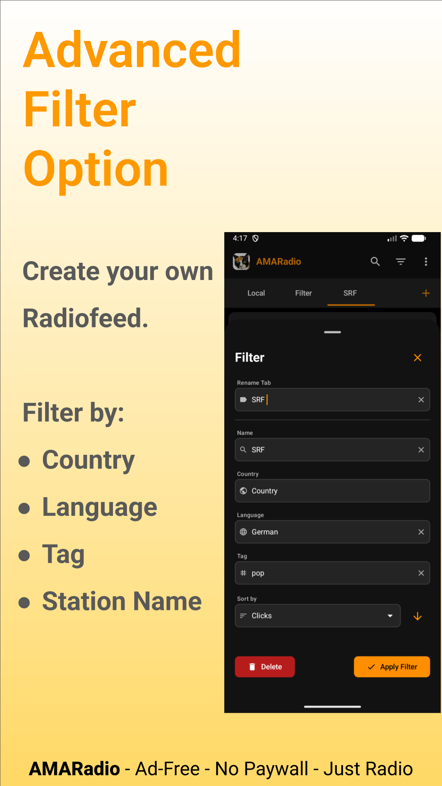
  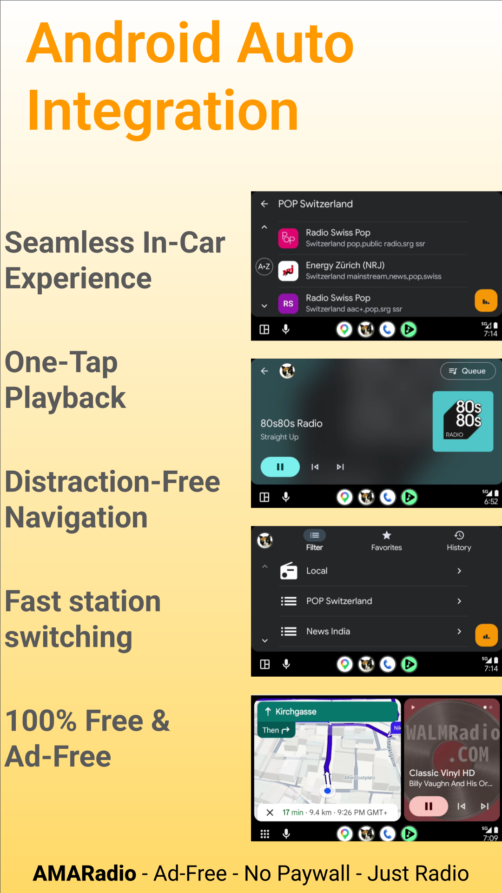
  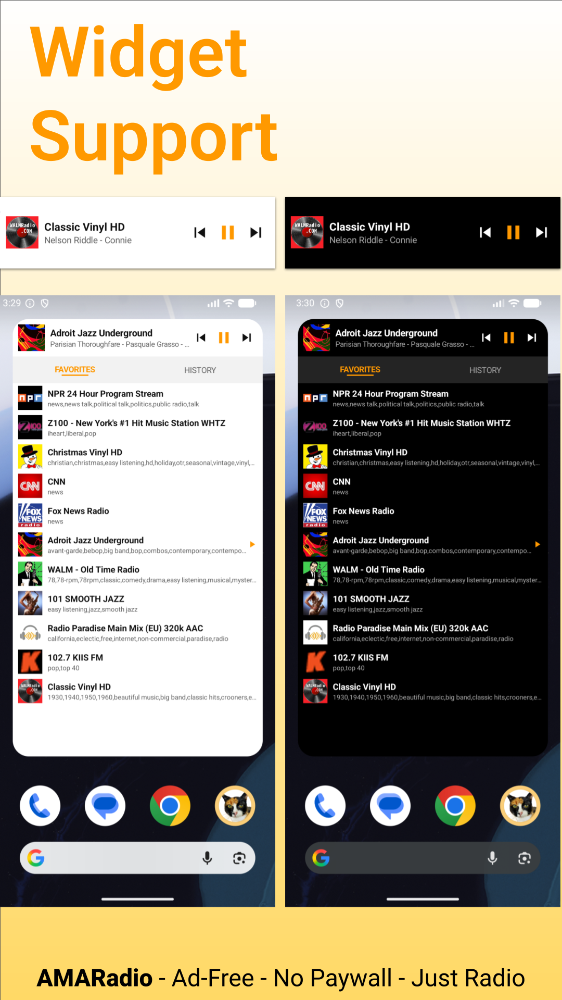
</p>
<p align="left">
  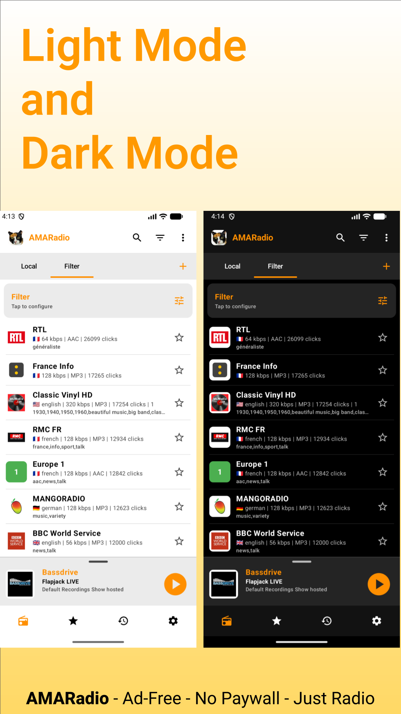
  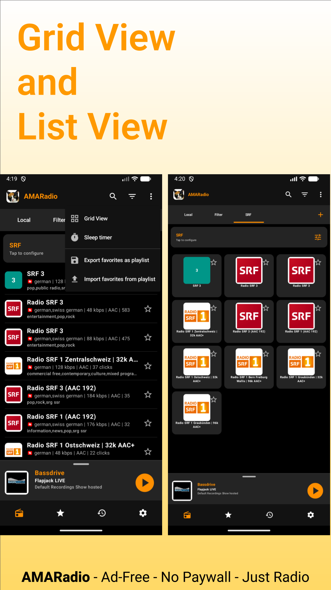
  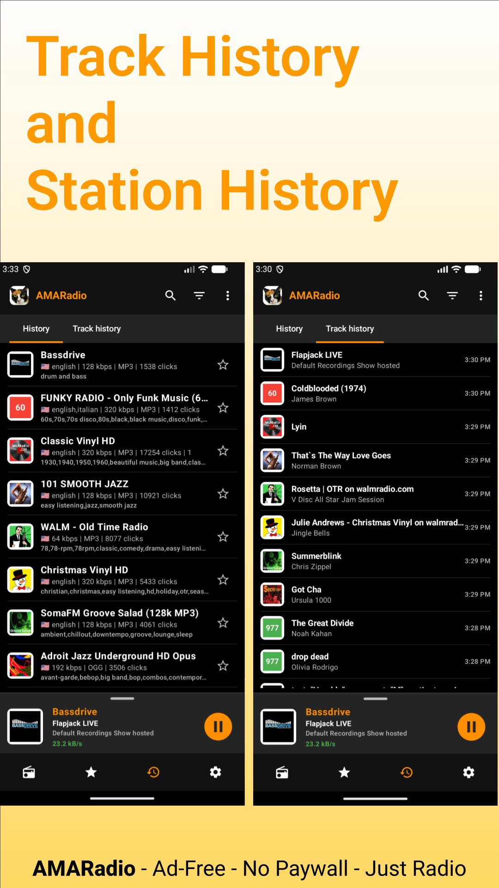
  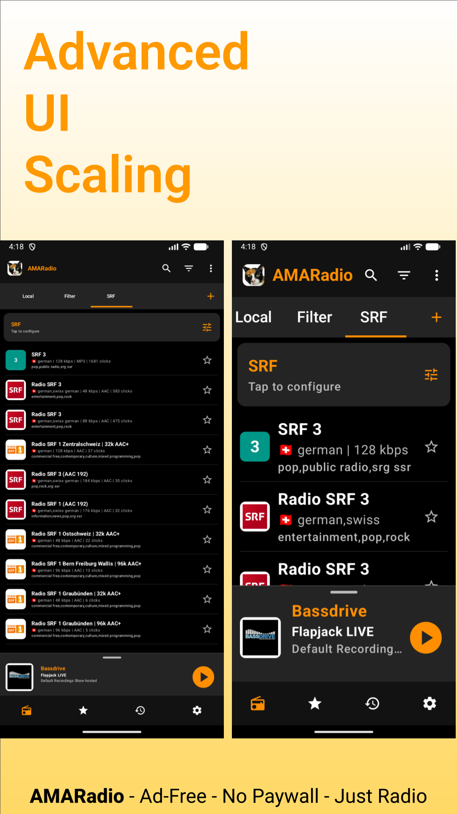
</p>
<p align="left">

  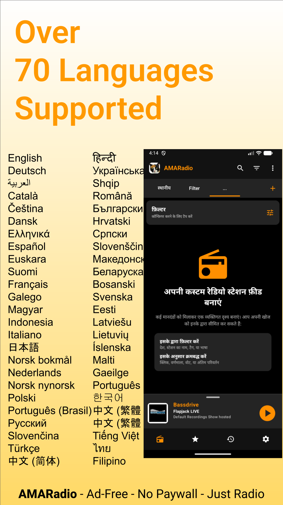
  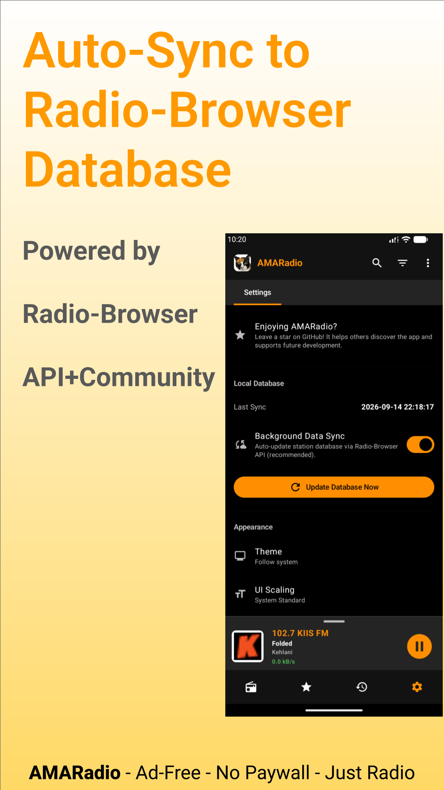
  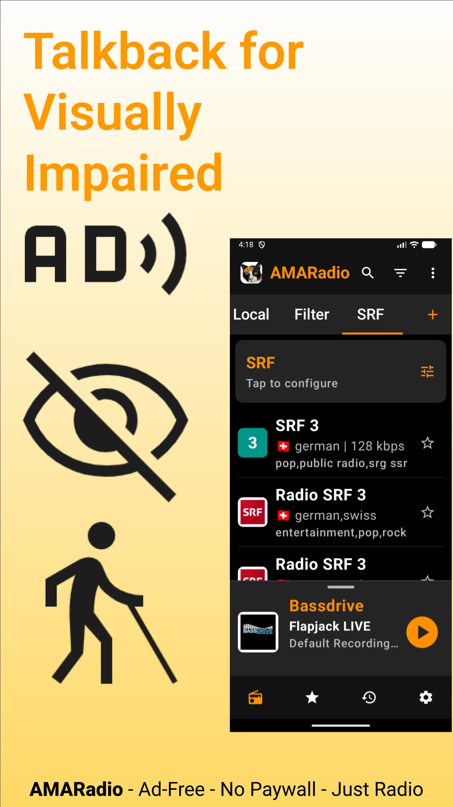
  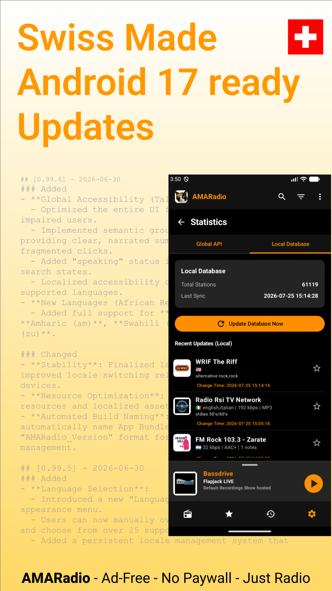
</p>

## Getting Started

### Installation
You can download the application from the [Google Play Store](https://play.google.com/store/apps/details?id=com.ounben.amaradio), [Obtanium](https://obtainium.imranr.dev/) or the [GitHub releases page](https://github.com/ounben/AMARadio/releases) .

### Building from Source
To build the project locally, ensure you have the latest version of Android Studio installed.

1. Clone the repository:
   ```bash
   git clone https://github.com/ounben/AMARadio.git
   ```
2. Open the project in **Android Studio**.
3. Build using the Gradle wrapper:
   ```bash
   ./gradlew assembleDebug
   ```

## Technical Specification

- **Language**: 100% Kotlin
- **UI Framework**: Jetpack Compose & Material 3
- **Architecture**: MVVM with Activity-scoped ViewModels for state management
- **Persistence**:
  - **Station Catalog**: High-performance SQL for the worldwide radio database.
  - **User Storage**: Dedicated SQL-based **UserDatabase** for Favorites, History, and custom Filters (migrated from legacy JSON).
- **Networking**: OkHttp 5 & Coroutines for API communication, Coil for async image loading
- **Media Engine**: AndroidX Media3 (ExoPlayer & CastPlayer)
- **Target SDK**: 37 (Android 17)
- **Minimum SDK**: 26 (Android 8.0)

## UML

<p align="left">
  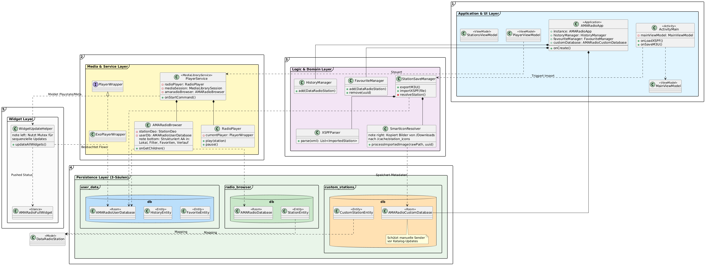
</p>

## Contributing

Contributions are welcome and appreciated. If you wish to improve the codebase, fix bugs, or update translations, please follow these steps:
- Report issues via the [GitHub Issue Tracker](https://github.com/ounben/AMARadio/issues).
- Submit improvements via Pull Requests.
- Translation updates are highly encouraged to improve global accessibility.

## License

This project is licensed under the **GNU General Public License v3.0**. Detailed information can be found in the [LICENCE](LICENCE) file.

---
<p align="left">
  AMARadio - Ad-Free - No Paywall - Just Radio.
</p>
